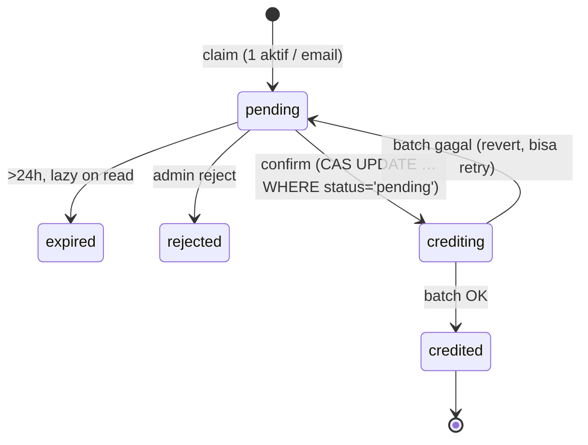

# PLAN — QRIS Static Top-up (App Token di D1)

**Status:** proposed · **rev2 — 2026-09-24**: buku besar token dipindah ke **D1 Cloudflare** (keputusan pemilik — konsolidasi auth+money di satu provider).
**Scope fase ini:** QRIS **statis** (payload merchant tetap, verifikasi manual admin) → **app token di D1 `kawai-auth`** (binding `DB`, satu database dengan auth), berjalan di **semua build** (excluded & `kawai-mono`).

---

## 0. Keputusan desain

| # | Keputusan | Alasan / bukti |
|---|---|---|
| D1 | **Paddle tidak dipakai** untuk top-up baru | Paddle AUP melarang "exchanges, dealers, trading platforms … crypto/virtual currency" **dan** "virtual currency or stored value, including store credit, gift cards, vouchers" → dead end untuk jual token on-chain *maupun* token app. [Paddle AUP](https://www.paddle.com/help/start/intro-to-paddle/what-am-i-not-allowed-to-sell-on-paddle) |
| D2 | **QRIS statis** — payload EMVCo merchant tetap, admin konfirmasi manual; klaim menyuntik tag 54 → QR per-klaim **dinamis** (prefill nominal, tetap tanpa gateway/webhook) | Tanpa gateway akuisisi (Midtrans/Xendit/DOKU/Tripay): nol API key baru, nol webhook, nol langganan. Gateway **dinamis** (QR per-transaksi + webhook) = fase 2. |
| D3 | Target = **token app** (ledger `user_balances`), **bukan** token on-chain | Menjual token KAWAI untuk Rupiah ke publik = penawaran aset kripto → wajib berizin PFAK/bursa ([POJK 27/2024](https://ojk.go.id/id/regulasi/Pages/POJK-27-2024-AKD-RK.aspx), diubah POJK 23/2025; pengawasan pindah Bappepti→OJK sejak 10 Jan 2025, transisi berakhir 20 Jan 2026). Jalur internasional (kartu/Paddle) sudah diblokir AUP (D1-row). Token app = produk "top up token layanan" — bersih dari sisi akuisir dan di luar rezim kripto OJK. |
| D4 | **2-build status quo dipertahankan** | Bukti di repo: `release.yml` membangun main `--features litert,tts,binance` (tanpa `monad`) + variant `kawai-mono` (`…,monad`); `src-tauri/Cargo.toml` `default = ["desktop"]`; web `--features web,tts` (tanpa monad). Token app universal → QRIS top-up **tidak menambah build**. |
| D5 | **Tukar token app→token on-chain tidak dibangun** (larang in-app) | Kalau token app bisa dibeli Rupiah lalu ditukar token on-chain di dalam app, regulator kembali melihat "penjualan token untuk Rupiah" → kembali ke masalah D3. Token app hanya untuk pemakaian layanan. |
| D6 | QRIS **hanya menerima pembayar Indonesia, Rupiah** | QRIS = rail domestik; pembayar sudah di yurisdiksi Indonesia. Pertanyaan lisensi melekat pada **produk yang dijual** (D3), bukan pada rail. |
| **D7** | **Ledger token pindah ke D1** (`kawai-auth`, binding `DB`) — auth + uang + klaim QRIS satu database | Identitas sudah di worker D1 (Ed25519, email) — `wrangler.toml` D1 `kawai-auth`. Jalur Supabase di repo ini sudah dicutover: `commands.rs::bill_turn` dihapus, debit usage kini `POST /billing/debit` (D1), admin top-up lewat `POST /admin/balance/credit` — satu-satunya penulis Supabase lama (`scripts/topup.ts` psql) ikut ditulis ulang. D1 = SQLite ACID single-primary — alasan doc lama memilih Supabase adalah ACID vs **KV**, bukan vs D1. Konsekuensi: confirm = **satu `DB.batch()` transaksional**, `email` = PK (tanpa bridge email→UUID), nol EF, nol secret baru. Revisi keputusan `[LOCK]` §1.1 `docs/BALANCE-KV-ARCHITECTURE.md` (same-commit). |

Referensi:

- Paddle AUP: https://www.paddle.com/help/start/intro-to-paddle/what-am-i-not-allowed-to-sell-on-paddle
- OJK POJK 27/2024: https://ojk.go.id/id/regulasi/Pages/POJK-27-2024-AKD-RK.aspx
- BI melarang kripto sebagai instrumen pembayaran: https://setkab.go.id/en/bank-indonesia-warns-all-parties-not-to-sell-buy-or-trade-virtual-currency/ (lapisan ini **tidak kena** — bayar memakai Rupiah, bukan kripto)

⚠️ D3 tetap **butuh cek klausul perjanjian akuisir/merchant QRIS Anda** (deklarasi tujuan usaha, aktivitas terlarang). Kalau tujuan akhir tetap IDR→KAWAI langsung: soal lisensi POJK 27/2024 — konsultasi hukum / listing di PFAK, bukan soal rail/build.

---

## 1. Kondisi saat ini (bukti di kode)

| Fakta | Bukti |
|---|---|
| Auth = email (worker D1 `kawai-auth`, Ed25519 token 7 hari); desktop `auth.token`, web cookie `kawai_session` | `kawai-server/worker/wrangler.toml:10-12`, `src/auth.ts`, `src-tauri/src/logic/local_auth.rs`, `src-tauri/src/web.rs` |
| D1 binding worker bernama `DB` (dipakai auth) + KV binding | `wrangler.toml`, `src/types.ts` |
| Keputusan lama: money → Supabase `[LOCK]` (argumen ACID vs **KV**); penulis aktif hanya `scripts/topup.ts` (psql → `private.user_balances`) | `docs/BALANCE-KV-ARCHITECTURE.md` §1.1, `scripts/topup.ts` |
| Jalur Supabase mati di repo: `commands.rs::bill_turn` stub `Skipped` (daftar `lib.rs:227`); `gateTurn`/`insufficient token credit` tak ada di frontend; `bill_usage`/`get_my_balance` tanpa pemanggil; EF `kawai/supabase/functions/` **tidak ada**; `x-worker-secret`/`WORKER_FN_SECRET` **nol kode**; `SUPABASE_URL` worker tak pernah dibaca | grep repo-wide + glob (`supabase/**` missing), `commands.rs:995-998` |
| `qrcode.react` (`QRCodeSVG`) sudah dependency | `frontend/src/features/wallet/wallet-page.tsx:17` |
| Pola top-up Paddle (`/topup/*`) sebagai pendahulu penamaan | `kawai-server/worker/src/index.ts` |
| `DATABASE_URL` Supabase (`db.mpencmdcjzfoahbuepwu.supabase.co`) **gagal DNS** dari mesin ini (2026-09-24) | percobaan psql — **perlu pulih untuk migrasi baris ledger lama** (§5) |

---

## 2. Arsitektur target

```mermaid
flowchart LR
    U[User app<br/>isi nominal] -->|topup_qris_claim| W[Worker CF<br/>qris.ts]
    W -->|1 pending / email<br/>nominal unik| QT[(D1 kawai-auth<br/>qris_topups)]
    W --> U2[Tampilkan QR dinamis<br/>(nominal ter-prefill)]
    U2 -->|Bayar Rupiah<br/>QRIS banking/e-wallet| B[Bank/PJS merchant<br/>→ settlement rekening Anda]
    A[Admin Anda<br/>cocok mutasi bank] -->|POST /topup/qris/confirm<br/>Bearer admin| W
    W -->|"DB.batch(): INSERT ledger (ref unique) + UPSERT balance + status='credited'"| D1[(D1: user_balances<br/>balance_ledger)]
    U -->|topup_balance| W
```

**Identitas = email = PK.** Worker sudah memegang email dari `authenticate()`; `user_balances(email PK)` — **tanpa bridge, tanpa UUID, tanpa Supabase Auth**. Sesi desktop/web tidak berubah (Ed25519/cookie).

### State machine `qris_topups.status`



Idempotency lapis (konfirmasi = transfer uang):

1. **CAS worker** — `UPDATE qris_topups SET status='crediting' WHERE tx_id=? AND status='pending'`; `changes!=1` → baca: `credited` → balas OK idempoten; `crediting` (crash recovery, >30 dtk) → langsung ke batch; lain → error.
2. **Satu batch transaksional** (semua D1 `batch()` dieksekusi dalam satu transaksi — dibuktikan lewat uji §11):

   ```sql
   -- stmt1: unique ref = jaring pengaman ganda (conflict → SELURUH batch rollback)
   INSERT INTO balance_ledger(email, amount, reason, ref, created_at)
   VALUES (?, ?, 'qris', ?, ?);
   -- stmt2: upsert nominal token
   INSERT INTO user_balances(email, tokens, updated_at) VALUES (?, ?, ?)
   ON CONFLICT(email) DO UPDATE SET tokens = user_balances.tokens + excluded.tokens,
                                    updated_at = excluded.updated_at;
   -- stmt3: tutup status
   UPDATE qris_topups SET status='credited', credited_at=? WHERE tx_id=? AND status='crediting';
   ```

   Unique-violation pada `balance_ledger.ref` → tangkap → tandai `credited` (sudah pernah masuk) → balas OK. Gagal lain → revert `status='pending'`, retryable.
3. **Klaim at-most-one** — 1 row `pending` per email (klaim ulang → row yang sama) → batas 900 kombinasi nominal, noise admin, spam row.

---

## 3. Fase 0 — Prasyarat: konsumen token (🔴 PERLU GO ANDA)

**Masalah:** token yang dijual **tidak punya pembeli** — `bill_turn` stub `Skipped`, `gateTurn` tidak ada, `bill_usage` tanpa pemanggil. Menjual top-up untuk ledger yang tak pernah didebit = menjual sesuatu yang tak bisa dipakai.

- **0a — Pre-check (wajib, murah):** UI baca `topup_balance`; submit goal diblokir bila token 0 ("Token habis — isi ulang lewat Top Up"), fail-open bila worker tak terjangkau (perilaku `gateTurn` lama pulih).
- **0b — Debit (wajib sebelum top-up berbayar dibuka):** worker `POST /billing/debit` (Bearer → email) → D1 atomic guard `UPDATE user_balances SET tokens = tokens - ? WHERE email=? AND tokens >= ?` → `changes==0` → 409 `insufficient_balance` (semantik `debit_balance` lama, kini lokal). Pemanggilan dipasang di **composition root `src-tauri/src/supervisor.rs`** (`plan_task` sudah menerima `usage`) — satu titik, desktop **dan** web sama-sama terdebit, tanpa logika billing di wrapper transport. Stub `commands.rs::bill_turn` **dihapus** (nol pemanggil — cutover bersih; kembali ke "ganti stub" tidak diperlukan). Enforcement tetap lemah (binary bisa di-patch — dokumentasi billing sudah mengakui), tapi token punya konsumen nyata; debit gagal = `warn` + lanjut (fail-open honor-system).

Efek samping pembersihan (clean cutover, saat Fase 0): jalur Supabase di `crates/foundation/billing` (fungsi JWT `bill_usage`/`get_my_balance`, `BillOpts`) diganti worker-proxy / dihapus dari panggilan — jangan biarkan dua jalur debit. **Tanpa GO Fase 0: shipping QRIS ditahan.**

---

## 4. Fase 1 — Worker (`kawai-server/worker`)

Modul baru `src/qris.ts` (pola `paddle.ts`, termasuk `ensureSchema()` idempotent) — **semua konfigurasi = konstanta di source** (aturan repo):

```ts
const QRIS_PAYLOAD = "00020101…"      // payload EMVCo QRIS statis milik merchant Anda
const MIN_BASE = 10_000; const MAX_BASE = 99_000; const BASE_STEP = 1_000; // rentang nominal pay-as-you-go
const TOKENS_PER_IDR = 100;           // tokens = base × rate (integer unit sama dgn scripts/topup.ts)
const EXPIRY_SECS = 86_400;
const ADMIN_EMAIL = "…";              // satu-satunya akun boleh confirm/list
```

Skema D1 (binding `DB` yang sudah ada, `ensureSchema` idempotent gaya `paddle.ts`):

```sql
CREATE TABLE IF NOT EXISTS user_balances (
  email TEXT PRIMARY KEY, tokens INTEGER NOT NULL DEFAULT 0, updated_at INTEGER NOT NULL
);
CREATE TABLE IF NOT EXISTS balance_ledger (
  id INTEGER PRIMARY KEY AUTOINCREMENT, email TEXT NOT NULL, amount INTEGER NOT NULL,
  reason TEXT NOT NULL,              -- 'qris' | 'manual' | 'turn' | 'seed'
  ref TEXT,                           -- tx_id / idempotency key
  created_at INTEGER NOT NULL
);
CREATE UNIQUE INDEX IF NOT EXISTS balance_ledger_ref ON balance_ledger(ref) WHERE ref IS NOT NULL;

CREATE TABLE IF NOT EXISTS qris_topups (
  tx_id TEXT PRIMARY KEY, email TEXT NOT NULL, package TEXT NOT NULL,
  idr_amount INTEGER NOT NULL, tokens INTEGER NOT NULL,
  status TEXT NOT NULL DEFAULT 'pending',  -- pending|crediting|credited|rejected|expired
  created_at INTEGER NOT NULL, reported_at INTEGER, credited_at INTEGER
);
CREATE INDEX IF NOT EXISTS qris_topups_email_status ON qris_topups(email, status);
```

Alokasi nominal unik: `base` (dipilih user, kelipatan 1000 dalam
`MIN_BASE..MAX_BASE`) + suffix `000–900` step 100 → `INSERT … ON CONFLICT DO
NOTHING`, rotasi start acak (konflik slot → suffix berikutnya), habis semua
10 slot → 503 `amount_pool_exhausted`. Base kelipatan 1000 + suffix < 1000 →
total selalu menentukan (base, suffix) unik, tidak mungkin tumpang tindih
antar base. Cek dulu 1-row-per-email (klaim idempoten: baris pending aktif
dikembalikan apa adanya). Expiry lazy: read `status`/`pending` mengubah `pending` lewat `EXPIRY_SECS` → `expired` (nominal dibebaskan).

Endpoint (semua lewat `authenticate()` yang sudah ada; admin = `ADMIN_EMAIL`):

| Method | Path | Body/Arg | Respons |
|---|---|---|---|
| GET | `/topup/qris/preview` | — | `{ qrPayload, minBase, maxBase, baseStep, tokensPerIdr }` (stateless) |
| POST | `/topup/qris/claim` | `{ amount }` | `{ txId, idrAmount, tokens, qrPayload, expiresAt }` — idempoten per email; `qrPayload` = QR dinamis (tag 54 = `idrAmount`) |
| GET | `/topup/qris/status/:txId` | owner-scoped | `{ status, idrAmount, tokens, createdAt, creditedAt? }` |
| GET | `/topup/balance` | — | `{ tokens }` → `SELECT tokens FROM user_balances WHERE email=?` (0 bila belum ada) |
| GET | `/topup/qris/pending` | admin | daftar `pending` (email, nominal, waktu) untuk matching mutasi bank |
| POST | `/topup/qris/confirm` | admin, `{ txId }` | alur CAS + batch (§2) → `{ status, tokens }` |
| POST | `/billing/debit` *(Fase 0b)* | `{ amount }` | atomic guard D1 → 409 `insufficient_balance` bila kurang |

`/transfer`, Paddle, auth, KV **tidak disentuh**.

---

## 5. Fase 2 — Migrasi data ledger Supabase → D1 (sekali jalan)

Prasyarat: koneksi `DATABASE_URL` pulih (gagal DNS saat ini — cek host/VPN).

1. **Cek dulu isi ledger lama:**
   ```sql
   select count(*), sum(usdt_balance) from private.user_balances;
   select count(*) from private.balance_ledger;
   ```
   Semua nol/kosong → **lewati import**, catat di catatan implementasi (migrasi = kosong).
2. **Export** (email-based — `auth.users.email` = email app):
   ```sql
   copy (select u.email, b.usdt_balance from private.user_balances b join auth.users u on u.id = b.user_id) to stdout with csv header;
   copy (select email, amount, reason, to_jsonb(ref), created_at from private.balance_ledger) to stdout with csv header;  -- riwayat audit, opsional tapi disarankan
   ```
3. **Import ke D1**: `npx wrangler d1 execute kawai-auth --remote --file …` (`INSERT … ON CONFLICT DO NOTHING`).
4. **Verifikasi count + sum** D1 == sumber; hanya lalu `wrangler deploy`.
5. **Cutover hygiene (same-commit):** baris `SUPABASE_URL` di `wrangler.toml` + `types.ts` dihapus (tak pernah dibaca); jalur billing Supabase diarahkan/dihapus sesuai Fase 0; `docs/BALANCE-KV-ARCHITECTURE.md` §1.1 ditulis ulang partisi-datanya (**data sekarang**: saldo/ledger/debt → D1 `kawai-auth`; KV tetap apikey/presence; auth tetap D1) — dokumentasi deskriptif kondisi kini, tanpa cerita migrasi.
   (Catatan implementasi: `.env` `SUPABASE_*`/`VITE_SUPABASE_*` jangan dihapus oleh agen — rahasia milik user; cukup tidak dipakai.)

## 6. Fase 3 — Ops Rust (4 op, dua wrapper — invarian wajib)

Semua op **auth-required**, proxy tipis ke worker dengan token dari session (frontend **tidak pernah** kirim token/user_id):

| Op (snake_case = fn = invoke = `POST /api/<op>`) | Pemicu worker |
|---|---|
| `topup_qris_preview()` | `GET /topup/qris/preview` |
| `topup_qris_claim(amount)` | `POST /topup/qris/claim` |
| `topup_qris_status(tx_id)` | `GET /topup/qris/status/:txId` |
| `topup_balance()` | `GET /topup/balance` |

- **`src-tauri/src/logic/topup.rs` (baru)** — murni (reqwest, tanpa tauri/axum), meniru `logic/local_auth.rs`; base URL helper worker yang sudah ada (pola `KAWAI_WORKER_URL` fallback konstan di `logic/local_auth.rs:27`) → **tanpa env baru**.
- **`commands.rs`** — 4 `#[tauri::command]`: ambil token (`stored_token(email)`) → `logic::topup::*` → `Result<T, String>`.
- **`web.rs`** — 4 route di **protected** router; handler **baca cookie `kawai_session` mentah** sebagai bearer (middleware tetap hanya meng-inject email).
- **`lib.rs`** — daftarkan 4 command di `generate_handler!` + `bill_turn` bila Fase 0 GO.
- `cargo check` desktop/web/feature-web wajib; mobile check karena `logic/` bersama (aturan repo).

## 7. Fase 4 — Frontend

- **`frontend/src/features/topup/` (baru)** — halaman **Top Up** terdaftar di Assets rail (`features/agents/assets-rail.tsx` / mirror registrasi halaman wallet — titik pasti saat implementasi). **Tanpa ikatan fitur `monad`** → tampil di build excluded **dan** mono.
- `QRCodeSVG` dari `qrcode.react` (sudah ada).
- Alur: isi nominal (pay-as-you-go, validasi rentang/kelipatan) → `topup_qris_claim` → QR + **nominal unik** + instruksi "transfer tepat, nominal ≠ dikembalikan" → polling `topup_qris_status` (5s × 5 menit, lalu backoff/manual refresh).
- States: `pending` "Menunggu verifikasi admin" → `credited` "Masuk ✓" / `rejected` / `expired` (klaim ulang).
- Kartu saldo `topup_balance`: "Saldo token: N" + empty-state "Hubungi admin"; bacaan yang sama untuk pre-check Fase 0a.
- Data lewat `call()` `@/lib/api` — komponen murni, jalan di web build. **Tanpa** on-chain/monad.

## 8. Fase 5 — Admin CLI + Dokumen (same-commit, aturan hygiene)

- **`scripts/qris.ts`**: `bun scripts/qris.ts list` · `confirm <tx_id>` · `reject <tx_id>` · `[--token-file <path>]` `[--url <worker>]` — token admin dari berkas `auth.token` (default: direktori data app `ADMIN_EMAIL`). **`scripts/topup.ts`** ditulis ulang jadi klien `POST /admin/balance/credit` (flag + pembacaan token sama; jalur psql `DATABASE_URL` tidak ada lagi).
- Dokumen ikut di-commit sama:
  - `kawai-server/worker/README.md` — tabel endpoint baru.
  - `docs/BALANCE-KV-ARCHITECTURE.md` — **§1.1 partisi data ditulis ulang (D1)**, §4b/§8 metode top-up + roadmap diperbarui, kalimat Supabase-usang dihapus (hygiene: deskripsikan kondisi kini).
  - `AGENTS.md` — daftar op auth-required + entri Roadmap + baris `logic/topup.rs` di tree.
  - `frontend/AGENTS.md` — bila rail/pages bertambah.

---

## 9. Konfigurasi & secret — nol var/env baru

| Nilai | Bentuk | Kenapa bukan env |
|---|---|---|
| `QRIS_PAYLOAD`, `MIN_BASE`/`MAX_BASE`/`BASE_STEP`/`TOKENS_PER_IDR`, `EXPIRY_SECS`, `ADMIN_EMAIL` | konstanta `qris.ts` | 1 nilai benar per deployment → hardcode (aturan repo) |
| D1 `kawai-auth` (binding `DB`) | `wrangler.toml` **sudah ada** (auth) | tabel baru di binding yang sama |
| `KAWAI_WORKER_URL` | pola **sudah ada** (`logic/local_auth.rs`) | fallback konstan sudah dibawa |
| `kawai_session` / `auth.token` | mekanisme auth **sudah ada** | — |

`WORKER_FN_SECRET`/`SUPABASE_SERVICE_ROLE_KEY` **tidak terlibat** dalam desain ini (EF gugur).

## 10. Risiko & mitigasi

| Risiko | Mitigasi |
|---|---|
| Kredit ganda (crash/retry/double klik) | CAS status + unique `balance_ledger.ref` → conflict membatalkan seluruh batch + re-drive `crediting` — **dibuktikan uji §11** (bukan asumsi) |
| Semantik rollback `batch()` D1 berbeda dari harapan | uji eksplisit: confirm 2× & simulasikan conflict → saldo naik 1×, lokal (`bun run dev`, D1 miniflare) sebelum deploy |
| Verifikasi manual salah cocok (transfer batal/nominal salah) | inherent (tanpa webhook) → **cocok mutasi bank** sebelum confirm; `pending` list menampilkan email/nominal/waktu; confirm idempoten |
| Nominal habis/bentrok (kombinasi 900) | 1 row aktif per email + expiry 24 jam + retry loop + 503 |
| Baris ledger lama tak termigrasi / jumlah tak diketahui | Fase 2 step 1 cek dulu (psql — DNS dulu); verifikasi count+sum sebelum deploy; nol → skip |
| Akuisir QRIS: ToS/MDR/blokir | cek perjanjian merchant Anda (D3) — di luar repo |
| Token tanpa konsumen | Fase 0 GO/NO-GO — tanpa 0b, top-up berbayar tidak dibuka |
| Enforce lemak (client laporkan usage) | disadari dokumen billing lama; pengetatan = proxy LLM server-side (roadmap terpisah, di luar scope) |

## 11. Verifikasi (per lapisan)

```sh
# Worker — typecheck + lokal (D1 miniflare)
cd kawai-server/worker && bun run typecheck && bun run dev
#   curl preview → claim → confirm 2×  →  /topup/balance naik TEPAT 1×  (bukti idempoten)
#   curl confirm pada tx_id random → 404; claim kedua saat pending ada → row sama

# Rust (semua wajib hijau)
cargo check
cargo check --features web
cargo check -p kawai --no-default-features --features web

# Frontend
bun run build
```

E2E uang nyata (setelah deploy): klaim → bayar nominal kecil sungguhan → `bun scripts/qris.ts confirm` → `bun scripts/qris.ts balance <email>` naik tepat → baris `balance_ledger` `reason='qris'` `ref=tx_id` (`wrangler d1 execute` / psql-style query) → **confirm kedua → saldo naik HANYA 1×**. Migrasi (§5): count+sum D1 == Supabase.

## 12. Non-goals (fase ini)

- QRIS **dinamis** gateway (Midtrans/Xendit/DOKU/Tripay): API key + webhook → fase 2.
- Penjualan IDR→token on-chain (D3/D5), konversi token app↔token on-chain.
- Menyentuh Paddle (`paddle.ts`), `/transfer`, auth, KV.
- Masa depan settlement/Merkle/rewards (dokumen lama menunjuk Supabase) — keputusan terpisah saat dibangun; jangan menghalangi konsolidasi ini.
- Varian web `kawai-mono` untuk top-up (token universal — tidak perlu).
- UI admin (CLI/curl cukup).

## 13. Urutan kerja

1. **GO/NO-GO Fase 0** (Anda) + isi §14.
2. Fase 1 worker (`qris.ts`: schema + 6 endpoint + debit bila GO) + `scripts/qris.ts`.
3. Fase 2 migrasi data (setelah psql DNS pulih; nol → skip) + cleanup cutover.
4. Fase 3 ops Rust (4 op, dua wrapper) + wiring Fase 0a/0b bila GO.
5. Fase 4 frontend halaman Top Up.
6. Docs same-commit → e2e pembayaran nyata → tutup.

## 14. Keputusan yang saya butuhkan dari Anda

1. **Fase 0: terpasang** — 0a (gate pre-check `topup_balance` di `use-workbench.run()`, fail-open) + 0b (debit `POST /billing/debit` di `supervisor::plan_task`, fail-open). Nonaktifkan bila berubah pikiran.
2. **Rate & rentang nominal**: ✅ dikonfirmasi 2026-09-25 — `MIN_BASE` 10_000 / `MAX_BASE` 99_000 / `BASE_STEP` 1_000 / `TOKENS_PER_IDR` 100 (Rp10.000 per 1 juta token; cost basis = langganan GLM Coding Plan, marginal cost ~0 di dalam kuota, retail per-token ≈ break-even).
3. **Payload QRIS statis**: ✅ diterima 2026-09-25 (TOKO KAWAI / Speed Cash) — terisi di `qris.ts`, CRC tervalidasi.
4. **`ADMIN_EMAIL`** (akun yang boleh `confirm`/`pending`) — ✅ terisi: `yudaprama@icloud.com` (konstanta `ADMIN_EMAIL` di `qris.ts`).
